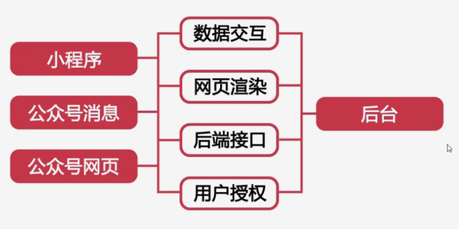
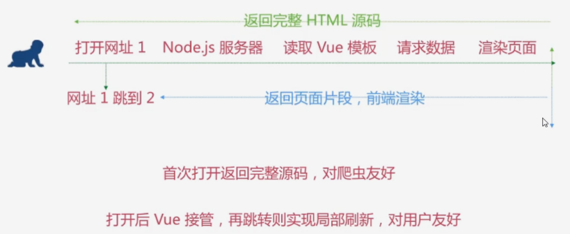
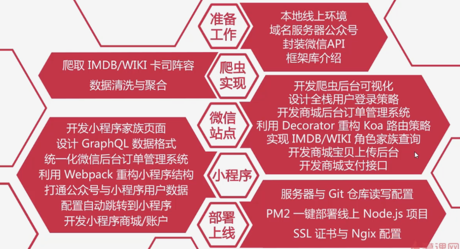
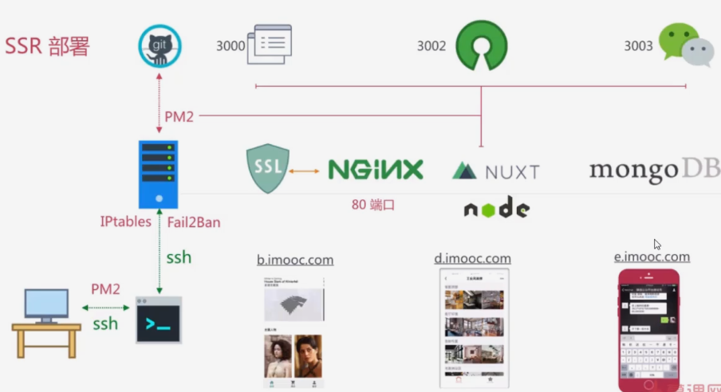

# full stack project

## SPA的 SEO

- 微信网页
- PC端网站

## Vu SSR

前后端同构项目-Vue SSR，服务器端直接渲染网页给前段，来让各种搜索引擎爬虫，可以正常的识别网页的内容。

## 申请认证

- 订阅号（个人、小公司，1个/日，可以转服务号-不可逆）
- 公众服务号（公司运营的平台，商城，支持，4篇文章/月）- 300元/年
- 企业号（大公司，例如考勤）
- 小程序
- 注册公司
- 域名申请备案（阿里云、DNSPod）
- 购买服务器（阿里云）
  - ubuntu 14.04(问题少)
